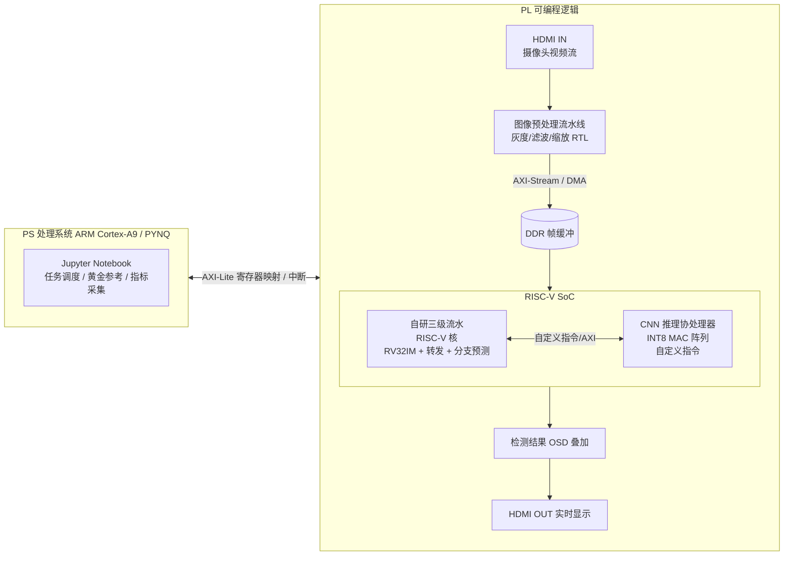

# EdgeSight —— 基于 PYNQ-Z2 的边缘智能视觉 SoC

> 全国大学生嵌入式芯片与系统设计竞赛'2026 · FPGA 创新设计赛道 · **AMD 自主选题赛道（初级组）** 参赛作品仓库

**一句话简介**：在 AMD PYNQ-Z2（Zynq-7020）上实现一颗**自研三级流水线 RISC-V 软核**，外挂**参数化 HDMI 视觉直通流水线**与**轻量 CNN 推理协处理器**，构成"摄像头进、检测结果出"的边缘智能视觉 SoC；PS 侧 Jupyter 提供可交互控制面板——实时调参、**软/硬件推理一键切换同屏对比**，并与 ARM 纯软件基线做全链路量化对比。命题升级方案见 [docs/proposal_upgrade.md](docs/proposal_upgrade.md)。

> 👋 新队友请先阅读 [docs/onboarding.md](docs/onboarding.md)（Git / Markdown / Agent 上手指南）

---

## 目录

- [项目背景与创新点](#项目背景与创新点)
- [系统架构](#系统架构)
- [三大核心模块](#三大核心模块)
- [软硬件划分与接口](#软硬件划分与接口)
- [性能指标与基线对比](#性能指标与基线对比)
- [仓库目录结构](#仓库目录结构)
- [开发计划](#开发计划)
- [组队分工](#组队分工)
- [风险预案（三级版本策略）](#风险预案三级版本策略)
- [大模型协作与 Skill 沉淀](#大模型协作与-skill-沉淀)
- [开发环境与复现](#开发环境与复现)
- [开源协议](#开源协议)
- [参考资料](#参考资料)

---

## 项目背景与创新点

边缘视觉节点（工业预检、智能门禁、桌面分拣）要求**本地、实时、低功耗**地完成"图像采集 → 预处理 → 推理 → 输出"全链路。通用 MCU 算不动 CNN，纯 ARM Linux 方案的预处理延迟和功耗又偏高。

本作品给出的答案是：**在 FPGA 里造一颗为视觉任务定制的 SoC**——

1. **自研三级流水 RISC-V 核（而非直接例化现成软核）**：以两级流水基线为对照，通过流水线重构、数据转发（旁路）、轻量分支预测优化 CPI，把"流水线优化"本身作为可量化验证的设计内容；
2. **RTL 图像预处理硬件流水线**：HDMI 视频流逐像素实时处理（灰度化 → 高斯滤波 → 缩放/边缘），零 CPU 占用，与 OpenCV 软件基线对比延迟与帧率；
3. **轻量 CNN 推理协处理器**：以自定义指令 + AXI 协处理器形式挂到 RISC-V 核上，INT8 量化，完成小型分类/检测网络推理，与 ARM Cortex-A9 纯软件推理对比加速比与能效。

**为什么不直接用 PYNQ Overlay + ARM？** 初级组考察的是 FPGA 基本设计能力。自研软核让我们的作品在"逻辑设计、状态机、时序约束、接口协议"四个考察点上全部有硬内容，而不是把难点都让给现成 IP。

---

## 系统架构



**演示闭环**：摄像头画面 → PL 预处理流水线 → 帧缓冲 → RISC-V 核调度 CNN 协处理器推理 → 识别结果叠加显示到屏幕；PS 侧同步运行软件基线并采集对比数据。

---

## 三大核心模块

### 模块一：自研三级流水 RISC-V 软核（流水线优化专项）

> 这是本项目"芯片设计"含量最高的部分，CPI 优化是可量化验证的核心创新点。

- 指令集：RV32IM（整数 + 乘除），按需裁剪
- 基线：两级流水（取指+译码 / 执行+访存+写回）
- 优化手段：
  1. 重构为**三级流水线**（IF / ID+EX / MEM+WB），提升主频
  2. **数据转发（旁路）电路**，消除 RAW 数据冒险气泡
  3. **轻量化分支预测**（1-bit/2-bit BHT），减少跳转冲刷
- 验证：riscv-arch-test 子集 + 自写 benchmark（Dhrystone 思路的整型测试程序）

### 模块二：HDMI 图像预处理硬件流水线

- HDMI IN → 解码 → 逐像素流水线：RGB→灰度 → 3×3 高斯滤波 → 双线性缩放（至网络输入尺寸）→ 可选 Sobel 边缘
- 行缓存（Line Buffer）调度，全流水无帧缓存依赖，**像素级延迟固定可测**
- **参数化直通链路**：滤波系数、缩放尺寸、ROI 经 AXI-Lite 由 PS/RISC-V 动态配置，现场实时调参
- **架构对比点**：行缓存直通 vs 传统"DDR 帧缓存回写"方案，延迟/带宽/资源三列实测对比（借鉴往届国一作品 Ultra-Vision 的"算法直出"架构，见 [docs/proposal_upgrade.md](docs/proposal_upgrade.md)）
- 对照组：PS 侧 OpenCV / 裸机 C 软件实现同算法

### 模块三：轻量 CNN 推理协处理器

- 形态：RISC-V **自定义指令扩展**（如 `conv.start` / `conv.wait`）+ AXI 协处理器，片内 INT8 MAC 阵列 + DMA 搬运权重/特征图
- 目标网络：小型分类网络（如 MNIST 级 / CIFAR 级 CNN，或剪枝后的轻量检测头），在 XC7Z020 资源内收敛
- 软件栈：PC 侧训练 + INT8 量化 → 导出权重 → RISC-V 裸机程序驱动协处理器
- 对照组：同一网络在 ARM Cortex-A9 上的纯软件推理
- **算子化验证**：CONV/POOL/GEMM 单算子逐一给出 ARM 基线加速比表（对标往届 HLS 算子赛道的评分打法）
- **同界面切换**：Jupyter 一键切换"ARM 软件推理 / 协处理器推理"同屏对比（借鉴往届国一 soft/hardware 双版本范式）

---

## 软硬件划分与接口

| 层级 | 承担者 | 职责 |
|:---|:---|:---|
| 实时像素处理 | PL（RTL 流水线） | HDMI 采集、预处理、OSD 叠加、显示输出 |
| 算力密集推理 | PL（协处理器） | CNN 卷积/全连接加速 |
| 任务控制 | PL（RISC-V 核，裸机 C） | 调度预处理与推理、协议解析、状态机 |
| 上位机/基准 | PS（PYNQ / Jupyter） | 寄存器配置、黄金参考比对、性能与资源数据自动采集、结果展示 |

**通信接口**：PS↔PL 采用 AXI-Lite（寄存器映射）+ 中断；PL 内部采用 AXI-Stream / 自定义握手 + DMA 访存 DDR。

---

## 性能指标与基线对比

所有指标均在真实板卡上实测，每组数据给出测试条件与原始日志。

| 指标 | 基线 | 目标 | 对比对象 |
|:---|:---|:---|:---|
| RISC-V 核 CPI（benchmark 平均） | 两级流水基线实测值 | 降低 ≥ 25% | 同核无优化版 |
| RISC-V 核最高主频 Fmax / WNS | 基线实测值 | ≥ 100 MHz，WNS ≥ 0 | 同核无优化版 |
| 图像预处理延迟 | 软件 OpenCV 实测值 | 降低 ≥ 10×，逐像素固定延迟 | PS 侧软件实现 |
| 直通 vs 帧缓存架构对比（延迟/带宽/资源） | DDR 帧缓存参考实现 | 直通优势量化在案 | 自建对照组 |
| 端到端帧延迟（采集 → OSD 显示） | 软件链路实测值 | ≤ 1 帧且可测 | PS 软件实现 |
| 演示动效帧率（OSD / 调参面板） | — | ≥ 30 fps 无坏帧 | — |
| CNN 推理单帧耗时 / 能效 | ARM A9 软件推理实测值 | 加速 ≥ 5× | 同网络同量化 |
| 资源占用 | — | LUT/FF/BRAM/DSP 均在 XC7Z020 内留 ≥ 20% 余量 | — |

> 具体数值随实现迭代更新，禁止先写目标后凑数据——先测基线，再谈优化。

---

## 仓库目录结构

> 按赛事要求：目录与文件名纯英文（小写字母、数字、下划线或连字符），中文只出现在正文；根目录只保留 `README.md` 与 `LICENSE`，其余文件入目录。
> 📖 每个文件夹"定位 + 现状 + 后续要做什么"的逐目录详解：[docs/repo_structure.md](docs/repo_structure.md)。

```
edgesight/
├── README.md            # 本文件（项目简介 + 复现步骤，指南 §3.3.5.4 提交物要求）
├── LICENSE              # MIT 协议
├── src/                 # 设计源码（RTL / 固件 / PS 侧软件）
│   ├── riscv/           # RISC-V 核 RTL（v0 两级流水已可仿真；plan/design 文档齐备）
│   ├── vision/          # HDMI 预处理流水线 RTL（占位）
│   ├── coprocessor/     # CNN 推理协处理器 RTL（占位）
│   ├── soc/             # 顶层集成、总线互连（占位）
│   ├── riscv_fw/        # RISC-V 裸机固件（冒烟 / 逐指令自检 / 后续 benchmark）
│   └── pynq_host/       # PS 侧 Jupyter 上位机：配置、采集、比对（占位）
├── sim/                 # testbench、仿真脚本（scripts/ 一键 iverilog；tools/ 含 RV32I 编解码自测）
├── build/               # Vivado 可复现构建 tcl + 综合/实现报告（占位）
├── board/               # 上板工程、运行脚本、实测输出（占位）
├── data/                # 测试数据与参考结果（metrics.csv 指标汇总 + logs/ + scripts/ + evidence/）
├── skill/               # 技能包（见下文）
├── report/              # 设计报告 + 大模型协作记录（llm_log/）
├── docs/                # 非强制扩展：上手 / 清单 / 调研 / 备考等过程文档（见对照表）
├── .github/             # Issue 模板（仓库基础设施，不属作品结构对照范围）
├── .gitignore           # 忽略编译产物（*.hex/*.coe 明确入库）
└── skill/understand-gate/  # 入库理解门槛 skill（OpenCode 自动加载位说明见其文件头）
```

### 与赛题指南推荐目录的对照

> 本赛道（AMD 自主选题）指南 **§3.3.5.4** 为**推荐结构、非强制**；采用其他组织方式的队伍须在 README 中给出目录对照说明，下表即该说明。
> 注：2026-09-14 已将顶层 `metrics/` 并入 `data/`、`sw/` 并入 `src/`，顶层与官方骨架一一对应。

| 本仓库 | 指南 §3.3.5.4 推荐 | 说明 |
|:---|:---|:---|
| `src/` | `src/`（设计源码） | RTL 四个子目录 + `riscv_fw/` 固件 + `pynq_host/` PS 侧软件 |
| `sim/` | `sim/` | testbench、仿真脚本与结果 |
| `build/` | `build/` | 可复现构建脚本 + 综合与实现报告（M2 起填充） |
| `board/` | `board/` | 上板工程、运行脚本与实测输出 |
| `data/` | `data/` | 测试数据、黄金参考与 `metrics.csv` 指标汇总（含 `logs/`、`scripts/`、`evidence/`） |
| `skill/` | `skill/` | 技能包（大模型协作沉淀，加分项） |
| `report/` | `report/` | 设计报告 + 大模型协作记录（`llm_log/`） |
| `docs/` | —（指南未列） | 非强制扩展：过程文档集中地（onboarding / 清单 / 赛题调研 / 备考 / Git 学习） |
| `.github/` `.gitignore` | — | 仓库基础设施，不参与作品结构对照 |

> `data/metrics.csv` 骨架已按指南要求建立（表头 + `logs/` + `scripts/` + `evidence/`），M3 实测时填充数值与证据；演示级指标增行说明见 `data/README.md`。

---

## 开发计划

| 阶段 | 时间 | 里程碑 |
|:---|:---|:---|
| 报名与选型 | 7.6 – 9.22 | 完成注册；搭建 Vivado/PYNQ 环境；RISC-V 核两级基线跑通单条指令 |
| M1：内核成型 | 9/14 – 10/4 | 三级流水 + 转发 + 分支预测完成，仿真全过；CPI/主频基线数据出炉（日粒度排期见 [src/riscv/plan.md](src/riscv/plan.md)）；**备考**：真题摸底 + 3 次限时专题 + 10/4 第一次全真模拟（[docs/exam_prep.md](docs/exam_prep.md)） |
| M2：协处理器 + 预处理 | 10 月上中旬 | 预处理流水线 HDMI 直通演示；CNN 协处理器跑通首个网络；**备考**：每周日下午 1 道真题，题型清单过半 + 口头解释练习 |
| M3：系统集成 | 10 月下旬 | SoC 全链路闭环上板演示；全部指标实测采集完成；**备考**：每周 1 题清完题型清单 + 全真模拟第 2 次（含口头解释） |
| M4：文档冲刺 | 11 月初 | 设计报告、协作记录、Skill、演示视频收尾；**备考**：五年真题全覆盖、每人全题型独立做过；离线资料整理（考场断网） |
| **作品提交** | **11.4 18:00 截止** | 提交全套材料 |
| 决赛准备 | 11 月 | Verilog 基础刷题 + 答辩演练（决赛 11.20–11.22 南京）；**备考**：全真模拟 2–3 次保持手感 |

> ⚠️ 决赛有**现场 Verilog 限时上机考核**，**不通过直接失去评奖资格**。细则（从五年真题仓库归纳）：现场**断网**、限时手写（时序逻辑、状态机、计数器）、监考**验收仿真波形**、可能被**口头解释代码**；赛场 Vivado 版本可能较旧，勿依赖新版特性。每周日下午固定 1.5h 备考，题型清单、全真模拟流程与真题进度跟踪见 **[docs/exam_prep.md](docs/exam_prep.md)**。

---

## 组队分工

| 角色 | 职责 | 主责模块 |
|:---|:---|:---|
| 逻辑开发主力 | Verilog 编写、模块调试 | RISC-V 核 + 协处理器 |
| 调试 + 验证 | 仿真、上板调试、指标采集 | 预处理流水线 + 系统集成 |
| 文档与答辩 | 设计报告、PPT、演示视频、Skill 沉淀 | PYNQ 上位机 + 全部文档 |

> 分工不分家：每周例会互讲进度，确保三人都能讲清任一模块——答辩质询不分工。

---

## 风险预案（三级版本策略）

| 版本 | 名称 | 内容 |
|:---|:---|:---|
| **L1 目标版** | 完整 SoC | 三级流水全优化 RISC-V + CNN 协处理器 + HDMI 预处理全链路 |
| **L2 稳健版** | 砍协处理器 | RISC-V 核（含流水线优化）+ HDMI 预处理流水线；CNN 推理退化为 RISC-V 核上的软件实现，加速比对比改为"预处理加速 + CPI 优化"两条线 |
| **L3 保底版** | 单点打透 | RISC-V 核三级流水 + 转发优化（分支预测可弃）+ 一路预处理（灰度+缩放），保证"流水线优化"这一核心创新点完整可测 |
| **L3.5 增强版**（stretch） | 检测-跟踪闭环 | L3 之上加"CNN 检测 → 自研核轻量跟踪 → OSD 闭环"；无新硬件，10/25–11/4 窗口，随时可砍（[docs/proposal_upgrade.md](docs/proposal_upgrade.md)） |
| **L4 扩展版**（冲奖） | EdgePilot 云台伺服 | 视觉引导控制全链路（[docs/idea1.md](docs/idea1.md)）；仅预采购舵机/云台，10 月中旬评估进度后再决定是否集成 |

**核心原则**：架构绝不降级，优化思想绝不取消；降级只砍广度，不砍深度。每个模块独立分支开发，随时可回退。

---

## 大模型协作与 Skill 沉淀

按 AMD 赛道要求，本项目全程记录大模型协作过程，并提炼可复用技能包。

**评委想看的是"纠错轨迹"，不是流水账**：AI 犯了什么错 → 怎么发现并喂回错误信息 → 修正 → 验证通过。一条完整的"失败—纠错—验证"记录，价值顶五十条"帮我写个 UART"。因此记录的单位是**设计决策点**，不是每一句对话。

### 落地流程

记录规范与模板见 [`report/llm_log/`](report/llm_log/README.md)，日常操作三条规矩：

1. **平时干活**：正常用 Kimi Work / OpenCode 工作，零额外负担。唯二规矩——AI 生成的 RTL 一律走 git commit（commit message 注明 prompt 要点）；agent 会话不删除
2. **入库门槛（先读懂，再 commit）**：看不懂的代码不许入库。按 `skill/understand-gate/SKILL.md` 执行——commit 前 agent 先给逐段讲解 + 3 道理解测试题，答对才提交，讲解与测试全量落盘 `report/llm_log/`；其他 agent 平台手动走 [docs/code_review_checklist.md](docs/code_review_checklist.md)
3. **每个工作日收尾**：在当前会话里让 agent 自己写日志：

   > 把今天解决 [XX问题] 的过程按 `report/llm_log/template.md` 写一条协作记录，存为 `report/llm_log/YYYY-MM-DD-英文主题.md`，相关 commit 填进去，经验沉淀部分判断要不要标 #skill候选。

4. **每周 15 分钟**：给有可复用价值的记录打 `#skill候选` 标签，作为期末技能包的原料

### Skill 沉淀方向

置于 `skill/`，强调换题换板仍可复用，每条注明是从哪几条日志（哪些失败）中总结的：

1. 通用 PYNQ Overlay 加载、校验与寄存器映射使用范式
2. RISC-V 核仿真—上板一致性验证清单（常见时序/冒险踩坑 + 排查步骤）
3. 黄金参考比对与性能/资源数据自动采集脚本（PYNQ 侧）
4. "根据综合报告定位时序瓶颈"的提示词工作流

> ⚠️ 两条铁律：**别造假、别后补**（评委抽查 git log 与日志时间戳必须对得上）；**commit 是锚点**（记录、代码、时间线三者互锁）。

---

## 开发环境与复现

- 板卡：AMD PYNQ-Z2（XC7Z020）
- 工具链：Vivado / Vitis 2025.2（免费 ML Standard；2026.1 BASIC 因年度续期 + 仿真受限仅备选，见 issue #2）、RISC-V GCC 工具链（MSYS2 ucrt64 `riscv32-unknown-elf`，RV32IM，见 [src/riscv_fw/README.md](src/riscv_fw/README.md)）、PYNQ v3.x 镜像
- 复现步骤：见 `board/README.md`（从零烧录 SD 卡 → 构建 bitstream → 运行演示）

---

## 开源协议

本项目采用 [MIT License](LICENSE) 开源。

---

## 参考资料

完整的分类资料清单（FPGA / SoC / RTL / CNN / PYNQ / HDMI / 体系结构，共 40+ 站点）见 **[docs/resources.md](docs/resources.md)**。

核心必读：

- AMD 赛道官方选题指南（自主选题赛道·初级组）
- 2026 全部 7 企业选题指南摘要（团队会议归档）：[docs/track_guides_2026_summary.md](docs/track_guides_2026_summary.md)
- PYNQ 官方文档：https://pynq.readthedocs.io/en/latest/
- 蜂鸟 E203 RISC-V 处理器配套书与源码：https://github.com/riscv-mcu/e203_hbirdv1
- HDLBits 在线刷题（上机考核必备）：https://hdlbits.01xz.net/
- FINN 量化神经网络加速框架：https://github.com/Xilinx/finn
- riscv-arch-test：https://github.com/riscv-non-isa/riscv-arch-test
- AMD 官方 HLS 学习案例：https://xilinx.github.io/xup_high_level_synthesis_design_flow/
- 大赛官网：http://www.fpgachina.cn/

---

> 本仓库持续更新，记录设计迭代、实测数据与踩坑过程。
