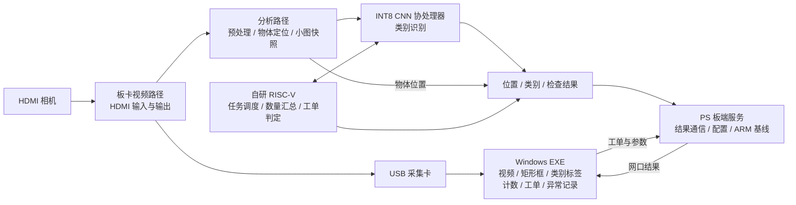

# 边缘慧眼（EdgeSight）——基于自研 RISC-V 的片上视觉分析仪

> 全国大学生嵌入式芯片与系统设计竞赛'2026 · FPGA 创新设计赛道 · **AMD 自主选题赛道（初级组）** 参赛作品仓库

**目标形态**：在 AMD PYNQ-Z2（Zynq-7020）上，用**自研 RISC-V 核、HDMI 视觉流水线与 INT8 CNN 协处理器**分析相机拍到的螺栓、螺母、垫圈等紧固件。板卡 HDMI 视频经 USB 采集卡进入 Windows **EXE 前端**，识别结果经网口同步到前端；统一展示物体矩形框、类别标签、数量统计、工单缺件/错料提示和异常记录，并与 ARM 软件基线对比。

> **当前进度（2026-10-09）**：模块一核＋最小 SoC 已完成收口，见[核收口报告](report/module1-closure.md)。
> 模块二 HDMI 视觉预处理 RTL＋已验证视频链路已完成（RTL／链路级），见[视频记录](data/logs/2026-10-03-vision-onboard/README.md)和[真实相机链路](data/logs/2026-10-07-pi-pynq/README.md)。
> **全项目 M2 验收未完成**；CNN、网络硬件输出和工业闭环不得宣称完成。EXE 预览／mock 原型已有证据，正式板端识别服务与定位部署仍待完成，见[项目主计划](plan.md)。

> 👋 新队友请先阅读 [docs/README.md](docs/README.md)（人读入口：5 分钟搞清目录与"找东西"规则），再读 [docs/onboarding.md](docs/onboarding.md)（Git / Markdown / Agent 上手指南）

---

## 目录

- [项目背景与创新点](#项目背景与创新点)
- [系统架构](#系统架构)
- [三大核心模块](#三大核心模块)
- [软硬件划分与接口](#软硬件划分与接口)
- [性能指标与基线对比](#性能指标与基线对比)
- [仓库目录结构](#仓库目录结构)
- [开发计划](#开发计划)
- [组队分工](#组队分工)
- [风险预案（三级版本策略）](#风险预案三级版本策略)
- [大模型协作与 Skill 沉淀](#大模型协作与-skill-沉淀)
- [开发环境与复现](#开发环境与复现)
- [开源协议](#开源协议)
- [参考资料](#参考资料)

---

## 项目背景与创新点

装配工位需要核对紧固件的类别和数量，并将识别结果与工单要求比较，发现缺件、多余件和错料。本项目围绕桌面实物检查，完成“相机采集 → 定位与识别 → 工单检查 → 界面与记录”的闭环。

本作品的定位是**桌面紧固件识别与工业检查系统**：板卡承担视觉分析和检查调度，Windows EXE 承担统一显示、工单配置与记录。首版检查类别和数量；裂纹、尺寸超差等质量缺陷检测需另行设计。

本作品给出的答案是：**在 FPGA 里造一颗为视觉任务定制的 SoC**——

1. **自研三级流水 RISC-V 核（而非直接例化现成软核）**：以两级流水基线为对照，通过流水线重构、数据转发（旁路）、轻量分支预测优化 CPI，把"流水线优化"本身作为可量化验证的设计内容；
2. **RTL 图像预处理硬件流水线**：HDMI 视频流逐像素实时处理（灰度化 → 高斯滤波 → 缩放/边缘），零 CPU 占用，与 OpenCV 软件基线对比延迟与帧率；
3. **轻量 CNN 推理协处理器**：以自定义指令 + AXI 协处理器形式挂到 RISC-V 核上，INT8 量化，完成小型分类/检测网络推理，与 ARM Cortex-A9 纯软件推理对比加速比与能效。

**为什么自研核，而不用 PicoRV32 / E203 现成软核？（用数据回答，不用情怀）**

1. **可审计的优化与面积数据**：当前同 RTL 四档 CoreMark CPI 为 1.885683／1.693399／1.616360／1.606121；BHT2 核 11.520 ns 实点 LUT=2443、FF=637（不含 SoC 存储器）。同负载参数收益与频率／资源口径见[核收口报告](report/module1-closure.md)；PicoRV32 仅有 OOC 和公开性能参考，不能据此宣称同负载面积能效领先。
2. **协处理器原生耦合**：现成核加 custom 指令需侵入他人微架构；自研核可在 EX 级原生集成 `conv.start/conv.wait`（协处理器 busy 直接进流水线 stall），这是外挂 AXI 方案做不到的集成深度
3. **裁剪的量化收益**：面向"推理控制负载"裁掉 CSR/trap（fence/ecall/ebreak 按 NOP），省掉用不到的特权级逻辑；代价与适用边界在报告中主动披露（不适用于需要中断/异常的通用场景）

**为什么不直接用 PYNQ Overlay + ARM？** 初级组考察的是 FPGA 基本设计能力。自研软核让我们的作品在"逻辑设计、状态机、时序约束、接口协议"四个考察点上全部有硬内容，而不是把难点都让给现成 IP。

---

## 系统架构


```mermaid
flowchart LR
    CAM[HDMI 相机] --> VIDEO[板卡视频路径<br/>HDMI 输入与输出]
    VIDEO --> CAP[USB 采集卡] --> UI[Windows EXE<br/>视频 / 矩形框 / 类别标签<br/>计数 / 工单 / 异常记录]
    VIDEO --> PRE[分析路径<br/>预处理 / 物体定位 / 小图快照]
    PRE --> COP[INT8 CNN 协处理器<br/>类别识别]
    CPU[自研 RISC-V<br/>任务调度 / 数量汇总 / 工单判定] <--> COP
    COP --> RES[位置 / 类别 / 检查结果]
    PRE -->|物体位置| RES
    CPU --> RES
    RES --> PS[PS 板端服务<br/>结果通信 / 配置 / ARM 基线]
    PS -->|网口结果| UI
    UI -->|工单与参数| PS
```

> **视频与分析分流（已实现的 RTL）**：显示路径保留彩色原图、分析路径独立预处理并保存片上快照，见[视觉契约](src/vision/design_v0.md)与[视频证据](data/logs/2026-10-03-vision-onboard/README.md)。真实识别坐标／类别叠加仍是目标；逐帧 DDR 回写仅为架构对照，不把“全链零 DDR”记为工业闭环实测。

**演示闭环**：放入紧固件 → EXE 展示实际识别框与类别 → 按工单核对类别和数量 → 缺件/错料提示 → 保存本次检查结果与异常截图。连续视频帧不重复累加批次；视频与网口结果须同步，断联或过期结果显示待确认。

**首版边界**：自由分散、互不遮挡；定位／裁剪 Python 黄金参考已有，板端部署与 CNN 分类未完成。模型和部署参数仍待冻结；同步协议已定轮次级／最多 16 目标，见[决策单](docs/vision-sync-protocol-decisions.md)。任意堆叠和遮挡识别不在首版范围。

---

## 三大核心模块

### 模块一：自研三级流水 RISC-V 软核（流水线优化专项）

> 这是本项目"芯片设计"含量最高的部分，CPI 优化是可量化验证的核心创新点。

- 指令集：RV32IM（整数 + 乘除），按需裁剪
- 基线：两级流水（取指+译码 / 执行+访存+写回）
- 优化手段：
  1. 重构为**三级流水线**（IF / ID+EX / MEM+WB），提升主频
  2. **数据转发（旁路）电路**，消除 RAW 数据冒险气泡
  3. **轻量化分支预测**（1-bit/2-bit BHT），减少跳转冲刷
- 验证：riscv-arch-test 子集 + 自写 benchmark（Dhrystone 思路的整型测试程序）
- 2026-10-07 收口证据：优化后 XSim 四档对拍、arch-test RV32M 扩展、BHT2 核11.520ns时序与40MHz真实上板；四档表及边界见 [模块一报告](report/module1-closure.md)。

### 模块二：HDMI 图像预处理硬件流水线

- HDMI IN → 解码 → 逐像素流水线：RGB→灰度 → 3×3 高斯滤波 → 双线性缩放（至网络输入尺寸）→ 可选 Sobel 边缘
- 行缓存（Line Buffer）调度，全流水无逐帧 DDR 回写依赖，**像素级延迟固定可测**
- **参数化链路**：当前 PS 经 AXI-Lite 配置视觉寄存器，配置原子生效；RISC-V 应用调度接入尚未实现
- **架构对比点**：行缓存直通 vs 传统"DDR 帧缓存回写"方案，延迟/带宽/资源三列实测对比（借鉴往届国一作品 Ultra-Vision 的"算法直出"架构，见 [docs/proposal_upgrade.md](docs/proposal_upgrade.md)）
- 对照组：PS 侧 OpenCV / 裸机 C 软件实现同算法

模块二 RTL／链路级证据见[视频记录](data/logs/2026-10-03-vision-onboard/README.md)和[真实相机恢复记录](data/logs/2026-10-07-pi-pynq/README.md)。板端现用位流与本地修复版指纹尚未闭环；长时间、冷启动与该位流断连恢复不据此宣称全过。

### 模块三：轻量 CNN 推理协处理器

- 形态：RISC-V **自定义指令扩展**（如 `conv.start` / `conv.wait`）+ AXI 协处理器，片内 INT8 MAC 阵列；推理输入为预处理缩放后的**片上快照小图**（KB 级 BRAM），权重经 DMA 预载
- 目标任务：对自由分散、互不遮挡的螺栓、螺母、垫圈进行传统视觉定位，裁剪小图后由 CNN 分类；网络结构由实际数据和 XC7Z020 资源确定。正式模型未实现，当前合成图片训练演练只证明训练导出链路可行。
- 软件栈：PC 侧训练 + INT8 量化 → 导出权重 → RISC-V 裸机程序驱动协处理器
- 对照组：同一网络在 ARM Cortex-A9 上的纯软件推理
- **算子化验证**：CONV/POOL/GEMM 单算子逐一给出 ARM 基线加速比表（对标往届 HLS 算子赛道的评分打法）
- **同界面切换**：EXE 切换“ARM 软件推理 / 协处理器推理”，同输入对比结果与耗时；Jupyter 保留为板端调试和复现入口。

---

## 软硬件划分与接口

| 层级 | 承担者 | 职责 |
|:---|:---|:---|
| 实时像素处理 | PL（RTL 流水线） | HDMI 输入输出、视频/分析分流、预处理；定位实现待契约冻结 |
| 算力密集推理 | PL（协处理器） | CNN 卷积/全连接加速 |
| 任务控制 | PL（RISC-V 核，裸机 C） | 快照与推理调度、数量汇总、工单判定 |
| 板端服务/基准 | PS（PYNQ） | 寄存器配置、结果通信、ARM 软件基线、黄金参考与指标采集；Jupyter 调试 |
| 工业操作界面 | PC（Windows EXE） | 采集卡视频、框与标签叠加、工单配置、统计、异常截图与记录导出 |

**通信边界**：PS↔视觉 PL 寄存器／快照接口已冻结，EXE↔服务轮次协议见[决策单](docs/vision-sync-protocol-decisions.md)；真实识别服务未实现，mock 不代表硬件识别。视频独立走 HDMI＋采集卡，单框 OSD 仅作诊断。

---

## 性能指标与基线对比

各指标分别标明仿真、实现或真实板卡口径，每组数据给出测试条件与原始日志。

| 指标 | 基线 | 目标 | 对比对象 |
|:---|:---|:---|:---|
| RISC-V 核 CoreMark CPI | v1 无转发 1.885683 | 固定乘法器仅转发门禁≥8.0%；组合25%为尽力目标 | fwd 1.693399（10.20%）；BHT2 1.606121；v0仅外部锚点，见收口报告 |
| RISC-V CoreMark/MHz / 每MHz面积归一值 | v0短迭代仿真外推1.506 | v0锚点及v1四档已入报告 | 同核参数矩阵；PicoRV32不同负载数据不作同负载加速比 |
| RISC-V 核通过约束点 / WNS | v0同脚本外推83.8MHz | BHT2核86.806MHz实点WNS≥0；100/125MHz非阻塞 | BHT2 WNS=+0.538；SoC/上板单列40MHz |
| 图像预处理延迟 | 软件 OpenCV 实测值 | 降低 ≥ 10×，逐像素固定延迟 | PS 侧软件实现 |
| 直通 vs 帧缓存架构对比（延迟/带宽/资源） | DDR 帧缓存参考实现 | 直通优势量化在案 | 自建对照组 |
| 板端视频延迟（输入 → HDMI 输出） | 软件链路实测值 | ≤ 1 帧的目标；采集卡/EXE 显示延迟另测 | PS 软件实现 |
| 视频显示帧率（EXE / 采集卡） | — | ≥ 30 fps，识别结果更新率另行实测 | — |
| CNN 推理单帧耗时 / 能效 | ARM A9 软件推理实测值 | 加速 ≥ 5× | 同网络同量化 |
| 资源占用 | — | LUT/FF/BRAM/DSP 均在 XC7Z020 内留 ≥ 20% 余量 | — |

> 具体数值随实现迭代更新，禁止先写目标后凑数据——先测基线，再谈优化。

---

## 仓库目录结构

> 目录与文件名使用英文，中文用于正文；根目录放项目 README、主计划、仓库规则与许可证，各模块目录只维护自身的源码、计划和接口。
> 📖 目录导航与"找东西"规则（日志/证据/计划各自放哪）：[docs/README.md](docs/README.md)；每个文件夹的职责见其目录内 README。

```
edgesight/
├── README.md            # 本文件（项目简介 + 复现步骤，指南 §3.3.5.4 提交物要求）
├── plan.md              # 全项目目标、收口时间、分工、验收与交付看板
├── LICENSE              # MIT 协议
├── src/                 # 设计源码（RTL / 固件 / PS 侧软件）
│   ├── riscv/           # v1 三级＋转发＋BHT 核与最小 SoC；收口证据见上方报告
│   ├── vision/          # HDMI 预处理 RTL；23 tb、已验证视频链路，证据见上方链接
│   ├── coprocessor/     # CNN 推理协处理器 RTL（M1 验收后主力转入）
│   ├── riscv_fw/        # RISC-V 裸机固件（冒烟 / 逐指令自检 / 后续 benchmark）
│   └── pynq_host/       # PS 配置／快照工具、mock 服务；正式识别服务未实现
├── sim/                 # testbench、仿真脚本（scripts/ 一键 iverilog；tools/ 含 RV32I 编解码自测）
├── build/               # Vivado 可复现构建 tcl + 综合/实现报告
├── board/               # 上板步骤、运行脚本与已有实机记录
├── data/                # 测试数据与参考结果（metrics.csv 指标汇总 + logs/ + scripts/ + evidence/）
├── skill/                 # 技能包（含 understand-gate 入库理解门槛 skill，OpenCode 自动加载位说明见其文件头）
├── report/                # 设计报告 + 大模型协作记录（llm_log/）
├── docs/                  # 非强制扩展：上手 / 清单 / 调研等过程文档（见对照表）
├── .github/               # Issue 模板（仓库基础设施，不属作品结构对照范围）
└── .gitignore             # 忽略编译产物（*.hex/*.coe 明确入库）
```

### 与赛题指南推荐目录的对照

> 本赛道（AMD 自主选题）指南 **§3.3.5.4** 为**推荐结构、非强制**；采用其他组织方式的队伍须在 README 中给出目录对照说明，下表即该说明。
> 注：2026-09-14 已将顶层 `metrics/` 并入 `data/`、`sw/` 并入 `src/`，顶层与官方骨架一一对应。

| 本仓库 | 指南 §3.3.5.4 推荐 | 说明 |
|:---|:---|:---|
| `src/` | `src/`（设计源码） | RTL 三个子目录（`riscv/` 含 SoC 外壳）+ `riscv_fw/` 固件 + `pynq_host/` PS 侧软件 |
| `sim/` | `sim/` | testbench、仿真脚本与结果 |
| `build/` | `build/` | 可复现构建脚本＋已有核／SoC／视觉综合实现报告 |
| `board/` | `board/` | 上板工程、运行脚本与实测输出 |
| `data/` | `data/` | 测试数据、黄金参考与 `metrics.csv` 指标汇总（含 `logs/`、`scripts/`、`evidence/`） |
| `skill/` | `skill/` | 技能包（大模型协作沉淀，加分项） |
| `report/` | `report/` | 设计报告 + 大模型协作记录（`llm_log/`） |
| `docs/` | —（指南未列） | 非强制扩展：过程文档集中地（onboarding / 清单 / 赛题调研） |
| `.github/` `.gitignore` | — | 仓库基础设施，不参与作品结构对照 |

> [data/metrics.csv](data/metrics.csv) 已有核／视觉指标与原始日志链接；工业闭环指标仍待 M3 实测。指标口径见 [data/README.md](data/README.md)。

---

## 开发计划

| 收口节点 | 截止时间（2026 年） | 交付结果 |
|:---|:---|:---|
| **M1 · 内核成型** | **10/4** | 功能、性能与可复现证据验收 |
| **M2 · 预处理与推理** | **10/12** | HDMI 直通可采集、首个网络跑通、EXE 视频/结果接口原型 |
| **M3 · 工业应用闭环** | **10/20** | 实物定位与分类、EXE 框/标签、计数、工单检查、批次记录、指标实测 |
| **M4 · 材料完成** | **10/26** | 报告、Skill、视频、EXE 发布包与复现清单 |
| 最终复验与答辩准备 | 11/3 | 修复、复验和答辩演练；增强功能按余量安排 |
| **作品提交** | **11/4 18:00 前** | 提交全套材料 |

只固定收口时间，阶段内按依赖推进并预留复验余量。全局分工、验收与交付看板见根目录 [项目主计划](plan.md)；RISC-V 技术任务与验收见 [核专项计划](src/riscv/plan.md)。

M1 检查点历史为 #19／#20／#21；正式合并和关闭记录见[模块一报告 §7](report/module1-closure.md)。10/4 是原截止日，不是实际收口记录日期。

---

## 组队分工

| 角色 | 职责 | 主责模块 |
|:---|:---|:---|
| 逻辑开发主力 | Verilog 编写、模块调试 | RISC-V 核 + 协处理器 |
| 调试 + 验证 | 仿真、上板调试、指标采集 | 预处理流水线 + 系统集成 |
| 文档与答辩 | 设计报告、PPT、演示视频、Skill 沉淀 | 板端复现与全部文档 |

> 分工不分家：每周例会互讲进度，确保三人都能讲清任一模块——答辩质询不分工。

EXE 由 `watercopper` 负责，已有[预览／mock 原型证据](data/logs/2026-10-06-vision-sync-schema/README.md)；板端真实服务主责已定 NC，正式服务与工业界面未完成。

---

## 风险预案（三级版本策略）

| 版本 | 名称 | 内容 |
|:---|:---|:---|
| **L1 目标版** | 完整工业检查系统 | 三级流水全优化 RISC-V + CNN 协处理器 + HDMI 视频/分析链路 + EXE 识别与工业检查闭环 |
| **L2 稳健版** | 砍协处理器 | RISC-V 核（含流水线优化）+ HDMI 预处理流水线；CNN 推理退化为 RISC-V 核上的软件实现，加速比对比改为"预处理加速 + CPI 优化"两条线 |
| **L3 保底版** | 单点打透 | RISC-V 核三级流水 + 转发优化（分支预测可弃）+ 一路预处理（灰度+缩放），保证"流水线优化"这一核心创新点完整可测 |
| **L3.5 增强版**（stretch） | 跨帧跟踪与流程辅助 | 基础版本验收后，按余量增加轻量跟踪或取料顺序确认；不替代目标版的框/标签与数量检查 |

**版本原则**：上表为全项目产品裁剪；核专项另有契约中“两级＋完整转发”时序保底，二者不能混为一条架构禁令。当前三级核已通过最低实点门禁，见[收口报告](report/module1-closure.md)。

---

## 大模型协作与 Skill 沉淀

按 AMD 赛道要求，本项目全程记录大模型协作过程，并提炼可复用技能包。

**评委想看的是"纠错轨迹"，不是流水账**：AI 犯了什么错 → 怎么发现并喂回错误信息 → 修正 → 验证通过。一条完整的"失败—纠错—验证"记录，价值顶五十条"帮我写个 UART"。因此记录的单位是**设计决策点**，不是每一句对话。

### 落地流程

记录规范与模板见 [`report/llm_log/`](report/llm_log/README.md)，日常操作三条规矩：

1. **平时干活**：保留 agent 会话与验证证据；AI RTL 必须先过理解门槛并取得提交授权，再 commit（message 注明 prompt 要点），不能产出即提交
2. **入库门槛（先读懂，再 commit）**：看不懂的代码不许入库。按 `skill/understand-gate/SKILL.md` 执行——commit 前 agent 先给逐段讲解 + 3 道理解测试题，答对才提交，讲解与测试全量落盘 `report/llm_log/`；其他 agent 平台手动走 [docs/workflow.md](docs/workflow.md) §2 检查单
3. **每个工作日收尾**：在当前会话里让 agent 自己写日志：

   > 把今天解决 [XX问题] 的过程按 `report/llm_log/template.md` 写一条协作记录，存为 `report/llm_log/YYYY-MM-DD-英文主题.md`，相关 commit 填进去，经验沉淀部分判断要不要标 #skill候选。

4. **每周 15 分钟**：给有可复用价值的记录打 `#skill候选` 标签，作为期末技能包的原料

### Skill 沉淀方向

置于 `skill/`，强调换题换板仍可复用，每条注明是从哪几条日志（哪些失败）中总结的：

1. 通用 PYNQ Overlay 加载、校验与寄存器映射使用范式
2. RISC-V 核仿真—上板一致性验证清单（常见时序/冒险踩坑 + 排查步骤）
3. 黄金参考比对与性能/资源数据自动采集脚本（PYNQ 侧）
4. "根据综合报告定位时序瓶颈"的提示词工作流

> ⚠️ 两条铁律：**别造假、别后补**（评委抽查 git log 与日志时间戳必须对得上）；**commit 是锚点**（记录、代码、时间线三者互锁）。

---

## 开发环境与复现

- 板卡：AMD PYNQ-Z2（XC7Z020）；已烧录 PYNQ 镜像并开通校园网 SSH 远程访问（`ssh xilinx@<板卡内网IP>`，详见 [board/README.md](board/README.md)）
- 工具链：Vivado / Vitis 2026.1（BASIC 免费档；XSim 限 50K 实例、仅 Windows，对本项目核级 tb 够用；2025.2 ML Standard 为回退备选，见 issue #2）、RISC-V GCC 工具链（MSYS2 ucrt64 `riscv32-unknown-elf`，RV32IM，见 [src/riscv_fw/README.md](src/riscv_fw/README.md)）、PYNQ v3.x 镜像
- 复现步骤：见 `board/README.md`（从零烧录 SD 卡 → 构建 bitstream → 运行演示）

---

## 开源协议

本项目采用 [MIT License](LICENSE) 开源。

---

## 参考资料

完整的分类资料清单（FPGA / SoC / RTL / CNN / PYNQ / HDMI / 体系结构，共 40+ 站点）见 **[docs/resources.md](docs/resources.md)**。

核心必读：

- AMD 赛道官方仓库（选题指南全文 TRACK_GUIDE_2026.md + 三赛道规则/开发板获取/技术支持）：https://gitee.com/Vickyiii/fpgachina26-amd
- 2026 全部 7 企业选题指南摘要 + 往届获奖作品调研（团队会议归档）：[docs/track_research.md](docs/track_research.md)
- PYNQ 官方文档：https://pynq.readthedocs.io/en/latest/
- 蜂鸟 E203 RISC-V 处理器配套书与源码：https://github.com/riscv-mcu/e203_hbirdv1
- FINN 量化神经网络加速框架：https://github.com/Xilinx/finn
- riscv-arch-test：https://github.com/riscv-non-isa/riscv-arch-test
- AMD 官方 HLS 学习案例：https://xilinx.github.io/xup_high_level_synthesis_design_flow/
- 大赛官网：http://www.fpgachina.cn/

---

> 本仓库持续更新，记录设计迭代、实测数据与踩坑过程。
