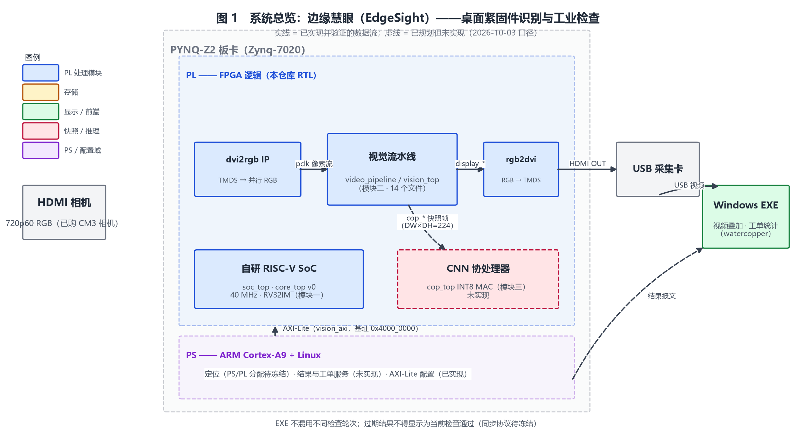
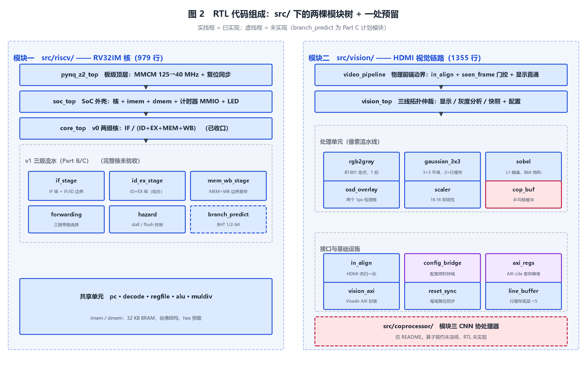
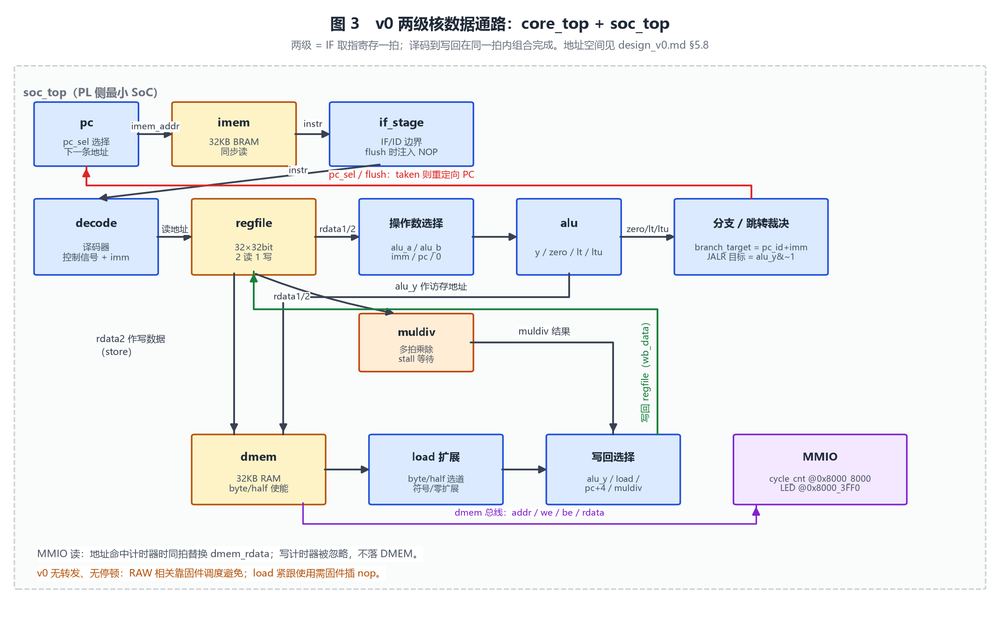
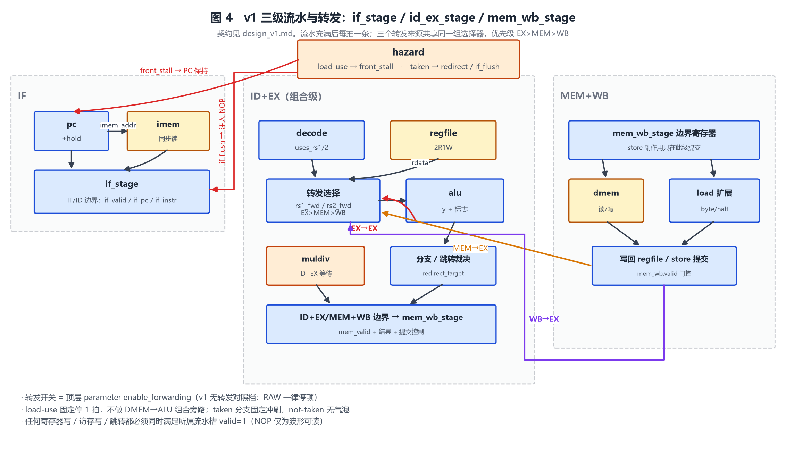
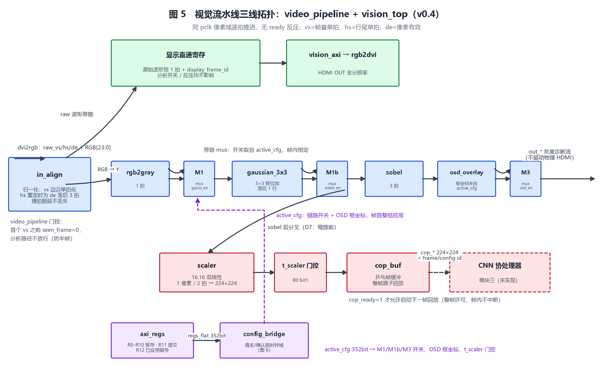
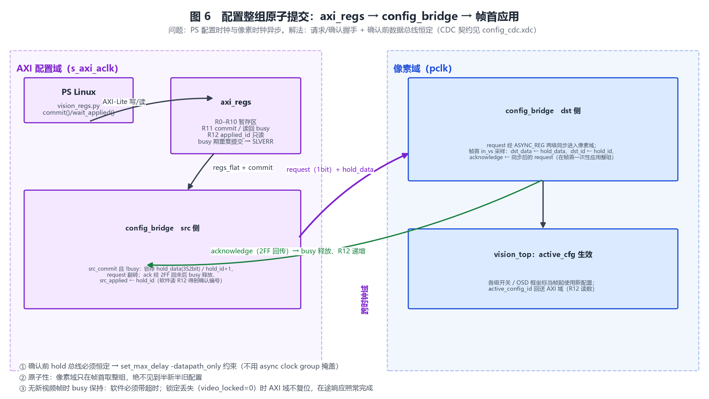
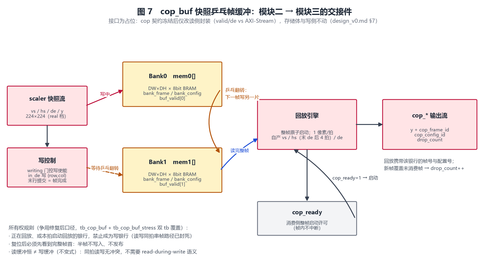

# 项目总览：边缘慧眼（EdgeSight）——RTL 组成与数据流

> 本文回答两个问题：这个项目是什么？RTL 代码怎么组织、数据怎么流动？
> **写作口径（ASD-STE100）**：本文按 ASD-STE100 简明技术英语规则的中文对应口径书写——
> 每句只写一个信息点；句子要短；用主动语态；用一般现在时；一个术语只指一个事物；
> 不用比喻和口语。模块名、信号名、寄存器名按代码原名写（STE 允许技术名）。
> **配图**：7 幅图由 [img/make_project_diagrams.py](img/make_project_diagrams.py) 生成。
> 重生成命令：`python docs/img/make_project_diagrams.py`。RTL 改动后须同步更新脚本。
> **状态口径**：2026-10-03。更细的契约见 [design_v0.md](../src/riscv/design_v0.md)、
> [design_v1.md](../src/riscv/design_v1.md)、[vision design_v0.md](../src/vision/design_v0.md)。

---

## 1. 系统是什么

本项目做一台桌面紧固件检查仪。相机拍摄螺栓、螺母和垫圈。零件自由摆放，互不遮挡。
视频进入 PYNQ-Z2 板卡。板卡完成三件事：图像预处理、物体定位、CNN 分类。
板上的 RISC-V 核调度检查、汇总数量、对照工单做判定。
识别结果发给 Windows EXE。EXE 显示视频、矩形框、类别标签和工单判定结果。
工单判定只有三类结论：缺件、多余件、错料。异常时 EXE 保存截图和批次记录。



数据走两条物理路径。视频路径：板卡 HDMI OUT → USB 采集卡 → EXE。
结果路径：板卡 PS → 网口 → EXE。两条路径的帧必须一一对应。
过期结果不得显示为当前检查通过。这条同步协议还没有冻结。

## 2. 三个模块与当前状态

| 模块 | 内容 | 负责人 | 状态 |
|:---|:---|:---|:---|
| 模块一 | 自研 RISC-V 核（v0 两级 → v1 三级） | jianglibo | v0 已收口；v1 集成未验收 |
| 模块二 | HDMI 图像预处理流水线 | never-die-cold | 离板 22 tb 收口；上板已通 |
| 模块三 | INT8 CNN 推理协处理器 | jianglibo | 未实现 |
| EXE 前端 | 视频叠加、工单统计、记录导出 | watercopper | 未实现 |

里程碑：M1（10/4）核验收；M2（10/12）预处理 + 首个网络 + EXE 原型；
M3（10/20）工业闭环；M4（10/26）材料收口；11/4 提交。

现状三类清单：

- ✅ **已实现并验证**
  - v0 两级核：38 用例 tb + SoC 冒烟 + arch-test 子集 PASS；
    OOC 实测 Fmax 83.8 MHz（LUT 1606 / FF 401 / BRAM 0 / DSP 0）。
  - 视觉链路离板全家福：22 个仓库内 tb，Icarus 与 XSim 同判据全 PASS；
    彩色直通分流、原子配置 CDC、cop_buf 争用修复、720p 真实时序。
  - 时序：video_pipeline 并行边界 OOC post-route WNS +0.330 @ 74.25 MHz；
    scaler real 档 ≈ 94.9 MHz。
  - 上板（2026-10-03）：全链验证 PASS；video_locked 挂死 bug 已修复；拔插复测 PASS。
  - PicoRV32 对比：与 v0 核同法对跑，Fmax 实测已入档（M4 前置提前完成）。
- 🟡 **已实现但未完成验收**
  - v1 三级流水的积木模块（if_stage / id_ex_stage / mem_wb_stage / forwarding / hazard）
    已入库，各有专项 tb；完整三级核的集成与验收未收口。
  - 端到端帧延迟未实测（需要 OSD 打点）。
- ⬜ **未实现 / 未接入**
  - 分支预测 BHT（`branch_predict.v`，Part C）；v1 两档运行命令未接入回归入口。
  - CNN 协处理器 `cop_top`；物体定位（PS/PL 分配待冻结）；逐目标裁剪。
  - 正式紧固件模型；工业检查固件；EXE 正式版；网口结果同步协议。

## 3. RTL 代码组成

RTL 有两棵树，加一处预留。核树在 `src/riscv/`，共 979 行。
视觉树在 `src/vision/`，共 1355 行。预留是 `src/coprocessor/`，现在只有 README。



核树分四层，从下往上集成：

- `pynq_z2_top`：板级顶层。它把 125 MHz 板钟降到 40 MHz。它同步释放复位。
- `soc_top`：SoC 外壳。它例化核、指令 BRAM、数据 RAM、计时器和 LED。
- `core_top`：v0 两级核。它是当前主线。
- v1 模块组：`if_stage`、`id_ex_stage`、`mem_wb_stage`、`forwarding`、`hazard`。
  它们服务 Part B/C。共享单元是 `pc`、`decode`、`regfile`、`alu`、`muldiv`、`imem`、`dmem`。

视觉树分三组：

- 顶层：`video_pipeline` 是物理前端边界。`vision_top` 仲裁三条像素通路。
- 处理单元：`rgb2gray`、`gaussian_3x3`、`sobel`、`osd_overlay`、`scaler`、`cop_buf`。
- 接口与基础设施：`in_align`、`config_bridge`、`axi_regs`、`vision_axi`、
  `reset_sync`、`line_buffer`（被窗口级和 scaler 复用，共 5 片）。

## 4. 模块一：核的数据流

### 4.1 v0 两级核（图 3）

v0 只有两级。第一级是 IF。第二级把译码、执行、访存、写回合在同一拍组合完成。



数据这样流动：

1. `pc` 给出取指地址。`imem` 同步读出一 条指令。
2. `if_stage` 锁存指令和 `pc_id`。遇到 flush 时，它下一拍注入 NOP。
3. `decode` 产出控制信号和立即数。`regfile` 读出两个源操作数。
4. 操作数选择器把立即数、`pc_id` 或 0 送给 `alu`。
5. `alu` 输出结果 `alu_y` 和三个标志：`zero`、`lt`、`ltu`。
6. 分支裁决用标志决定 taken。taken 时 `pc_sel` 切换 PC，并冲刷 IF。
7. 访存用 `alu_y` 作地址。store 数据来自 `rdata2`。字节/半字写有 lane 使能。
8. load 数据做符号扩展或零扩展。写回选择器四选一：`alu_y`、load 数据、`pc_id+4`、乘除结果。
9. `muldiv` 是多拍单元。核在它算完之前保持 stall。结果经写回选择器进寄存器堆。

v0 没有转发，也没有停顿。RAW 相关靠固件调度避开。load 后紧跟使用时，固件要插 nop。

SoC 侧有两个 MMIO 地址。读 `0x8000_8000` 得到周期计数器。写 `0x8000_3FF0` 驱动 LED。
写计时器地址被忽略，不落 DMEM。

### 4.2 v1 三级流水（图 4）

v1 把两级拆成三级：IF、ID+EX、MEM+WB。流水充满后每拍提交一条。



两个流水边界：

- IF/ID 边界由 `if_stage` 拥有。它携带 `if_valid`、`if_pc`、`if_instr`。
- ID+EX/MEM+WB 边界由 `mem_wb_stage` 拥有。store 副作用只在这一级提交。

三条转发路径共用一组选择器。优先级固定为 EX > MEM > WB：

- **EX→EX**：相邻两条指令的 RAW。ALU 结果直接旁路给下一条指令。
- **MEM→EX**：隔一条指令的 RAW。结果从 MEM+WB 槽旁路回来。
- **WB→EX**：更早的写回值。寄存器堆此时还没写入，靠旁路拿新值。

`hazard` 只做两个动作：

- load-use：前一条是 load 且本条用它的目的寄存器。固定停 1 拍。没有 DMEM→ALU 组合旁路。
- taken 分支或跳转：冲刷 1 个年轻槽。IF 下一拍注入 NOP。not-taken 不产生气泡。

转发有顶层参数 `enable_forwarding`。关掉它就是"v1 无转发"对照档：RAW 一律停顿。
所有副作用都以流水槽 `valid=1` 为前提。NOP 只为波形可读，不产生副作用。

## 5. 模块二：视觉流水线的数据流

### 5.1 像素流约定

全链在同一个像素时钟 `pclk` 域逐拍推进。没有 ready 反压。
`de=1` 表示当前像素有效。`vs` 是帧首单拍标记。`hs` 是行尾单拍标记。
像素是 24 位 RGB。灰度级是 8 位 Y。
`in_align` 负责把 dvi2rgb 的原始波形归一化到这套约定。

### 5.2 三条通路（图 5）

`vision_top` 把像素流分成三条。开关来自 `active_cfg`，帧内恒定。



- **显示通路**：原始 RGB 波形恒 1 拍直通，附带 `display_frame_id`。
  分析开关、缩放和消费反压都不影响它。这是上屏的唯一来源。
- **分析通路**：`rgb2gray` → [gaussian] → [sobel] → [osd] → `out_*`。
  `out_*` 是灰度诊断流，不驱动物理 HDMI。OSD 的两个框坐标来自配置寄存器。
- **快照通路**：在 sobel 之后分叉（D7 决策：全分辨率上做边缘，缩放后信息已损失）。
  `scaler` 缩到 CNN 输入尺寸，`cop_buf` 存整帧，`cop_*` 交给模块三。

`video_pipeline` 还有一个门控：首个 `vs` 到来之前，分析路径不放行。这防止半帧进入流水线。

### 5.3 每一级做什么

- `rgb2gray`：BT.601 定点，`Y = (77R + 150G + 29B) >> 8`。延迟 1 拍。
- `gaussian_3x3`：核 `[1 2 1; 2 4 2; 1 2 1]/16`，全移位加，无乘除。
  双行缓存轮替，输出落后输入 1 行。末行在消隐期冲刷补出。
- `sobel`：Gx、Gy 取 L1 幅值 `|Gx|+|Gy|`，8 位饱和。窗口装配与冲刷和 gaussian 同构。
- `scaler`：16.16 定点双线性。1 像素 / 2 拍。目标尺寸即 CNN 输入尺寸（real 档 224×224）。
- `osd_overlay`：两个 1 像素描边框。参数帧首锁存，帧内改参数不影响当前帧。

### 5.4 配置如何跨时钟域生效（图 6）

PS 的配置时钟和像素时钟异步。直接写寄存器会撕裂配置。所以配置走整组原子提交。



流程有五步：

1. 软件写 R0–R10。这些写进暂存区，不立即生效。
2. 软件写 R11 提交。`config_bridge` 锁存整组 352 位数据和配置编号，翻转 request。
3. 像素域在帧首 `in_vs` 采样 request。整组落地为 `active_cfg`，当帧生效。
4. 像素域回送 acknowledge。AXI 域释放 busy。软件读 R12 得到确认编号。
5. busy 期间重复提交返回 SLVERR。无新帧时 busy 保持，软件必须带超时。

三条 CDC 纪律：确认前数据总线恒定（用 `set_max_delay -datapath_only` 约束，
不用异步 clock group 掩盖）；两级同步器全部加 `ASYNC_REG`；
锁定丢失时 AXI 域不复位，在途响应照常完成（2026-10-03 上板挂死 bug 的教训）。

### 5.5 快照如何交给 CNN（图 7）

`cop_buf` 是模块二和模块三的交接件。它用两片 BRAM 做乒乓帧缓冲。



工作方式：

- 写侧逐像素写入当前银行。末行提交即帧完成。
- 读侧等 `cop_ready`。`cop_ready` 是整帧启动许可，不是逐像素反压。
  启动后以 1 像素/拍整帧原子回放，帧内不中断。
- 回放携带该银行的帧号和配置号。消费侧据此建立帧对应关系。

所有权规则有四条：正在回放或本拍启动回放的银行禁止当写银行；
复位后必须先看到完整帧首，半帧不写入也不发布；
新帧覆盖未消费帧时 `drop_count` 加一；
读缓冲恒不等于写缓冲，同拍读写无冲突。

接口是占位。cop 契约冻结后只改读侧封装，存储体和写侧不动。

## 6. 一帧数据的完整旅程

以一个真实像素为例，它走过这些站：

1. 相机发出 TMDS 串行信号。
2. `dvi2rgb` 把它转成并行 RGB 和 `vs/hs/de`。
3. `in_align` 归一化标记。`video_pipeline` 用 `seen_frame` 挡住半帧。
4. 显示通路：原始波形寄存 1 拍，`rgb2dvi` 串化，HDMI OUT 出图。
5. 分析通路：灰度化、平滑、边缘、OSD 叠加，出灰度诊断流。
6. 快照通路：缩放到 224×224，`cop_buf` 存成整帧。
7. （未来）`cop_top` 做 INT8 推理。RISC-V 核汇总类别和分数。
8. PS 对照工单，生成判定。网口发给 EXE。
9. EXE 在对应帧上叠框、标签和判定。

显示走第 4 步，结果走第 5–9 步。两条路延迟不同。
所以帧/检查的对应关系必须显式携带（`display_frame_id`、`cop_frame_id`），不能靠时序猜。

## 7. 验证体系

一键回归是唯一验证入口：`bash sim/scripts/run_iverilog.sh all`。
它覆盖核 tb、门禁自检、22 个视觉 tb 和 Python 检查。任何一项 FAIL 都算整体 FAIL。

- 每个视觉单元都有黄金参考。Python 生成输入和期望，tb 逐像素比对。数据在 `data/golden/vision/`。
- iverilog 全 PASS 后，XSim 用同一判据复跑（`bash sim/scripts/run_vision_xsim.sh all`）。
- 时序证据来自 Vivado OOC post-route 报告。关键数字见第 2 节状态清单。
- 原始日志在 `data/logs/`。每个结论都能靠仓库内脚本重放。

## 8. 未实现清单（明确标注）

- `branch_predict.v`：未实现。Part C 范围。
- v1 完整三级核：未集成验收。v1 两档运行命令未接入 `run_iverilog.sh`。
- `cop_top`（CNN 协处理器）：未实现。算子契约未冻结。
- 物体定位：未实现。PS/PL 分配待冻结。
- 逐目标裁剪：未实现。依赖定位输出。
- 正式紧固件数据集与模型：未完成。采集规程已入库。
- 工业检查固件与工单规则：未实现。
- EXE 正式版：未实现。前端原型联调在 M2。
- 网口结果同步协议：未冻结。
- 端到端帧延迟：未实测。

## 9. 文档关系与复现入口

| 想了解 | 去哪里 |
|:---|:---|
| 全项目目标、分工、里程碑 | 根目录 [plan.md](../plan.md) |
| 核专项与验收 | [src/riscv/plan.md](../src/riscv/plan.md) |
| v0 核接口契约 | [src/riscv/design_v0.md](../src/riscv/design_v0.md) |
| v1 流水契约 | [src/riscv/design_v1.md](../src/riscv/design_v1.md) |
| 视觉接口与寄存器映射 | [src/vision/design_v0.md](../src/vision/design_v0.md) |
| 开工清单与理解门槛 | [docs/workflow.md](workflow.md) |

复现命令：

```bash
python docs/img/make_project_diagrams.py      # 重生成本文 7 幅图
bash sim/scripts/run_iverilog.sh all          # 全量回归（核 + 视觉 22 tb）
bash sim/scripts/run_vision_xsim.sh all       # XSim 同判据复跑
```

## 自测题（理解门槛演练）

1. v0 为什么不需要转发单元也能跑对？v1 打开转发后，哪一类相关仍然必须停顿？为什么？
2. 配置写入 R0 后为什么画面不立刻变？软件要怎么确认这组配置已经生效？
3. `cop_ready` 拉高期间，快照写侧正在写 Bank0。此刻 Bank1 刚好写完一帧。回放引擎会怎么选？
