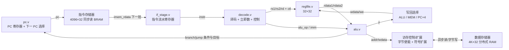

# v0 接口设计：RV32I 两级流水基线核

> 状态：📌 接口冻结（2026-09-11），RTL 待开发（Part A，9/21 开工）
> 依据：`plan.md` 部分 A「两级流水基线核 v0」——先打通工具链闭环，拿下后续一切对比的锚点数据。
> 本文是 v0 RTL 开发与 testbench 的唯一接口权威；改动须在 `report/llm_log/` 留决策记录。

---

## 1. 目标与验收

- 指令集：**RV32I 全指令**（M 扩展 Part A 收尾补，接口预留，见 §10）
- 结构：两级流水（IF / ID+EX+MEM+WB），单时钟，异步复位低有效 `rst_n`
- 验收：RV32I 冒烟全过；上板跑通 LED；基线 CPI / Fmax 记录进 `report/`

## 2. 两级流水结构与时序

### 2.1 拍序

| 拍 | 级 | 动作 |
|:---:|:---|:---|
| 拍 1 | IF | `pc` 输出 → `imem_addr`；指令 BRAM **同步读**（本拍地址，下一拍数据有效） |
| 拍 2 | ID+EX+MEM+WB | 译码 → 读 regfile → ALU → 访存（异步读数据 RAM）→ 写回；分支/跳转裁决 → 下一拍 PC |

```
拍 k   : 取指 N        （imem_addr = PC_N）
拍 k+1 : 执行 N        （instr = N）；同时取指 N+1（PC_N+4）
拍 k+2 : 执行 N+1（分支/跳转生效时此槽位作废为 NOP）
```

### 2.2 数据冒险：v0 **无 RAW 停顿**

- 指令 N 在拍 k+1 **末**写回 regfile；指令 N+1 在拍 k+2 译码读寄存器 → 读到的已是新值；
- `lw` 在拍 2 经**异步读**数据 RAM 取数并同拍写回 → 无 load-use 停顿；
- 结论：**v0 的 CPI ≈ 1 + 分支代价**（M 阶段除法多拍停顿另计）。

> 该性质是 v0 作为"锚点"的核心：v1 三级流水引入的 RAW/load-use 风险，正是通过数据转发（旁路）来消除。锚点数据必须来自真实仿真/上板，禁止推算。

### 2.3 控制冒险：跳转/分支 **1 拍气泡**

- 拍 2 解析分支条件与目标，取指侧默认顺序取 `PC+4`（天然"预测不跳"）；
- 分支/跳转生效时：已取到的顺序指令作废（插入 NOP），下一拍 `pc_sel=target`；
- 代价：**每发生一次跳转 1 拍气泡**（未发生 0 代价）；
- 这正是 Part C 分支预测（BHT）要打进的目标。

### 2.4 结构冒险：无

指令/数据存储分离（哈佛式），取指与访存互不干扰。

## 3. 存储器接口（已冻结决策）

### 3.1 指令存储器：同步读 BRAM

- 语义：本拍给出 `imem_addr`，`imem_rdata` **下一拍**有效（BRAM 标准行为）；
- SoC 外壳实现：4096 × 32bit，`$readmemh` 预载 hex（格式见 §9），复位后 PC = `0x8000_0000`；
- 仿真 tb 用同语义存储器模型。

### 3.2 数据存储器：异步读（分布式 RAM）

- 语义：`dmem_addr` → `dmem_rdata` **同拍**有效；
- 写支持 4 位字节使能 `dmem_be`（`sb/sh/sw` 与小端字节序由核生成使能）；
- 容量建议 4K × 32bit（够 v0 冒烟；后续按需扩）。

### 3.3 地址空间

- v0 哈佛分离，两侧各自从 `0x8000_0000` 起：指令侧 `0x0–0x3FFF`、数据侧 `0x0–0x3FFF`；
- 固件 `tohost` 约定在数据侧 `0x8000_3FF0`（即 `dmem` 偏移 `0xFFC`），tb 直接读该单元判定 PASS/FAIL；数据 RAM 上电初值全 0（无预载）。

## 4. 模块划分（v0）

| 模块 | 文件 | 职责 | 备注 |
|:---|:---|:---|:---|
| PC | `src/riscv/pc.v` | PC 寄存器 + 下一 PC 选择（+4 / 目标 / 保持） | 保持用于 M 阶段多拍停顿 |
| 取指级 | `src/riscv/if_stage.v` | 指令流水寄存器；作废（NOP 插入）/ 停顿控制 | |
| 译码 | `src/riscv/decode.v` | 指令译码 → 全部控制信号 + 立即数生成 | 控制真值表见 §6 |
| 寄存器堆 | `src/riscv/regfile.v` | 32×32，2 读 1 写；`x0` 恒 0 | 组合读、时钟沿写 |
| ALU | `src/riscv/alu.v` | 算术/逻辑/移位/比较；分支条件输出 | |
| 乘除单元 | `src/riscv/muldiv.v` | M 扩展（v0 **预留不实现**，接口冻结） | 见 §10 |
| 核顶层 | `src/riscv/core_top.v` | 例化互连、分支裁决、流控 | 对外接口见 §5.8 |
| SoC 外壳 | `src/soc/soc_top.v` 等 | 指令 BRAM + 数据 RAM + LED + 核 | v0 上板冒烟用 |

## 5. 模块接口信号表

### 5.1 `pc.v`

| 端口 | 方向 | 位宽 | 说明 |
|:---|:---:|:---:|:---|
| `clk` / `rst_n` | in | 1 | 时钟 / 异步复位低有效 |
| `pc_sel` | in | 2 | 00=PC+4；01=跳转目标；10=保持（stall） |
| `pc_target` | in | 32 | 跳转/分支目标地址 |
| `stall` | in | 1 | 保持 PC（M 阶段多拍用，v0 恒 0） |
| `pc` | out | 32 | 当前 PC（接指令存储器地址） |
| `pc_plus4` | out | 32 | PC+4（顺序取指 / `jal` 写回） |

### 5.2 `if_stage.v`（IF 级流水寄存器）

| 端口 | 方向 | 位宽 | 说明 |
|:---|:---:|:---:|:---|
| `clk` / `rst_n` | in | 1 | 复位后首拍内部注入气泡，保证首条指令只执行一次 |
| `pc` | in | 32 | 当前取指 PC（锁存为 `pc_id`） |
| `imem_rdata` | in | 32 | 指令存储器同步读回数据（BRAM 输出寄存器即本级的指令源） |
| `flush` | in | 1 | 分支/跳转已生效：**下一拍**注入 NOP（`0x00000013`） |
| `stall` | in | 1 | 保持当前指令（M 阶段多拍用，v0 恒 0） |
| `instr` | out | 32 | 当前执行指令（flush 注入拍为 NOP） |
| `instr_valid` | out | 1 | 有效指示（注入拍为 0，供调试/统计） |
| `pc_id` | out | 32 | 当前指令的 PC，供分支目标求值与 `jal/jalr` 写回 PC+4 |

> 实现要点：BRAM 输出寄存器与 `if_stage` 之间**不再加第二级寄存器**（否则变三级流水）；`flush_q` 在分支裁决后的拍住 NOP，形成 1 拍气泡。

### 5.3 `decode.v`

| 端口 | 方向 | 位宽 | 说明 |
|:---|:---:|:---:|:---|
| `instr` | in | 32 | 待译码指令 |
| `rs1_addr` / `rs2_addr` / `rd_addr` | out | 5 | 寄存器索引 |
| `imm` | out | 32 | 立即数（I/S/B/U/J 由 `imm_type` 选择） |
| `imm_type` | out | 3 | I=0, S=1, B=2, U=3, J=4 |
| `alu_op` | out | 4 | 见 §6.1 |
| `alu_a_sel` | out | 2 | 00=rs1；01=PC；10=0（`lui`） |
| `alu_b_sel` | out | 2 | 00=rs2；01=imm；10=保留 |
| `wb_sel` | out | 2 | 00=ALU；01=load 数据；10=PC+4；11=保留（M 扩展） |
| `reg_write` | out | 1 | 写回使能 |
| `mem_read` / `mem_write` | out | 1 | 访存读 / 写 |
| `mask_sel` | out | 2 | 00=byte；01=half；10=word |
| `sign_ext` | out | 1 | load 符号扩展（`lb/lh`=1，`lbu/lhu`=0） |
| `branch_type` | out | 3 | 见 §6.3 |
| `jump_type` | out | 2 | 00=无；01=JAL；10=JALR |
| `muldiv_op` | out | 2 | v0 恒 00（预留，见 §10） |

### 5.4 `regfile.v`

| 端口 | 方向 | 位宽 | 说明 |
|:---|:---:|:---:|:---|
| `clk` | in | 1 | 写端口时钟沿写入；读为组合 |
| `raddr1` / `raddr2` | in | 5 | 读地址 |
| `rdata1` / `rdata2` | out | 32 | 读数据（同拍有效） |
| `waddr` | in | 5 | 写地址 |
| `wdata` | in | 32 | 写数据 |
| `we` | in | 1 | 写使能；`waddr==0` 时无效 |

### 5.5 `alu.v`

| 端口 | 方向 | 位宽 | 说明 |
|:---|:---:|:---:|:---|
| `a` / `b` | in | 32 | 操作数 |
| `alu_op` | in | 4 | 见 §6.1 |
| `y` | out | 32 | 运算结果 |
| `zero` / `lt` / `ltu` | out | 1 | 比较标志（分支条件用） |

### 5.6 `muldiv.v`（v0 预留）

| 端口 | 方向 | 位宽 | 说明 |
|:---|:---:|:---:|:---|
| `clk` / `rst_n` | in | 1 | |
| `op` | in | 2 | 00=乘；01=除；10=取余；11=OFF |
| `start` | in | 1 | 启动 |
| `a` / `b` | in | 32 | 操作数 |
| `result` | out | 32 | 结果（v0 未实现） |
| `busy` | out | 1 | 忙（接 stall；v0 恒 0） |

### 5.7 `core_top.v`（核对外唯一接口）

| 端口 | 方向 | 位宽 | 说明 |
|:---|:---:|:---:|:---|
| `clk` / `rst_n` | in | 1 | |
| `imem_addr` | out | 32 | 指令地址 |
| `imem_rdata` | in | 32 | 指令数据（**下一拍**有效） |
| `dmem_addr` | out | 32 | 数据地址 |
| `dmem_wdata` | out | 32 | 写数据 |
| `dmem_be` | out | 4 | 字节使能（小端） |
| `dmem_we` | out | 1 | 写使能 |
| `dmem_rdata` | in | 32 | 读数据（**同拍**有效） |

### 5.8 SoC 外壳（`src/soc/`，v0 上板冒烟）

| 模块 | 职责 |
|:---|:---|
| `soc_top.v` | 例化 `core_top` + 指令 BRAM + 数据 RAM + LED 驱动；`clk` 来自板载晶振，`rst_n` 接复位按键/上电复位 |
| 指令 BRAM | 4096×32，同步读，`$readmemh` 预载 `sw/riscv_fw/hello.hex` |
| 数据 RAM | 4K×32，异步读，4 位字节使能 |
| LED 驱动 | v0 冒烟：LED = 分频计数器高位（证明时钟/复位/下载链路通），或 PC 高位；实现时定 |

## 6. 控制信号编码与真值表

### 6.1 `alu_op`

| 编码 | 运算 | 编码 | 运算 |
|:---:|:---|:---:|:---|
| 0000 | ADD | 0101 | SRL |
| 0001 | SUB | 0110 | SRA |
| 0010 | SLL | 0111 | SLT |
| 0011 | XOR | 1000 | SLTU |
| 0100 | OR | 1001 | AND |

> 分支比较不占 `alu_op`：由 `branch_type` 选择 `zero/lt/ltu` 标志。

### 6.2 `imm_type`

| 编码 | 类型 | 拼接方式 |
|:---:|:---|:---|
| 000 | I | `instr[31:20]` 符号扩展 |
| 001 | S | `instr[31:25]` + `instr[11:7]` 符号扩展 |
| 010 | B | 符号扩展，最低位 0 |
| 011 | U | `instr[31:12]` 左移 12，低位 0 |
| 100 | J | 符号扩展，最低位 0 |

### 6.3 `branch_type` / `jump_type`

| `branch_type` | 条件 | `jump_type` | 含义 |
|:---:|:---|:---:|:---|
| 000 | 不分支 | 00 | 无跳转 |
| 001 | BEQ | 01 | JAL（写回 PC+4） |
| 010 | BNE | 10 | JALR（写回 PC+4） |
| 011 | BLT | | |
| 100 | BGE | | |
| 101 | BLTU | | |
| 110 | BGEU | | |

### 6.4 RV32I 指令 → 控制信号真值表

| 指令 | `imm_type` | `alu_a_sel` | `alu_b_sel` | `wb_sel` | `reg_write` | `mem_read` | `mem_write` | `branch_type` | `jump_type` |
|:---|:---:|:---:|:---:|:---:|:---:|:---:|:---:|:---:|:---:|
| R-type (`add` 等) | — | rs1 | rs2 | ALU | 1 | 0 | 0 | 0 | 0 |
| I-arith (`addi` 等) | I | rs1 | imm | ALU | 1 | 0 | 0 | 0 | 0 |
| I-shift (`slli` 等) | I | rs1 | imm | ALU | 1 | 0 | 0 | 0 | 0 |
| Load (`lw/lb/lh/lbu/lhu`) | I | rs1 | imm | MEM | 1 | 1 | 0 | 0 | 0 |
| Store (`sw/sb/sh`) | S | rs1 | imm | — | 0 | 0 | 1 | 0 | 0 |
| B-type | B | rs1 | rs2 | — | 0 | 0 | 0 | 见 §6.3 | 0 |
| `lui` | U | 0 | imm | ALU | 1 | 0 | 0 | 0 | 0 |
| `auipc` | U | PC | imm | ALU | 1 | 0 | 0 | 0 | 0 |
| `jal` | J | PC | imm | PC+4 | 1 | 0 | 0 | 0 | JAL |
| `jalr` | I | rs1 | imm | PC+4 | 1 | 0 | 0 | 0 | JALR |
| `fence` / `ecall` / `ebreak` | — | — | — | — | 0 | 0 | 0 | 0 | 0 |

> `fence/ecall/ebreak` v0 按 NOP 处理（不写回、不访存）；冒烟与 arch-test 子集不覆盖系统指令。

### 6.5 访存字节使能与扩展

| 指令 | `mask_sel` | 地址对齐假设 | 读扩展 | 写使能 |
|:---|:---:|:---|:---|:---|
| `lw` / `sw` | word | 4 字节对齐 | — / — | `be=4'b1111` |
| `lh` / `sh` | half | 2 字节对齐 | `sign_ext` 定 | `be = addr[1] ? 4'b1100 : 4'b0011` |
| `lb` / `sb` | byte | 无 | `sign_ext` 定 | `be = 4'b0001 << addr[1:0]` |

> v0 不实现非对齐异常（misaligned trap），工具链/固件保证对齐。

## 7. 顶层框图（v0）



## 8. 与软件/工具链约定

| 项 | 约定 |
|:---|:---|
| 指令 hex 格式 | `sw/riscv_fw/bin2hex.py` 输出：每行 8 位十六进制、32 位小端字、行号 = 地址/4 |
| 入口 | 复位后 PC = `0x8000_0000`；`start.S` 设 `sp`、清 `.bss`、`call main` |
| 冒烟判据 | v0 核（RV32I）：`hello_v0` → `tohost = 13`、`tohost_exit = 0`（见 `sw/riscv_fw/main_v0.c`）；M 补齐后启用 RV32IM 程序：`tohost = 142879`、`tohost_exit = 0` |
| 结果与退出码 | `main` 写结果到 `tohost(0x8000_3FF0)`；`start.S` 写退出码到 `tohost_exit(0x8000_3FF4)`，二者分离 |
| 停机 | 固件最后死循环自旋；tb 跑固定拍数后检查（非 halt 信号） |
| 工具链 | MSYS2 ucrt64 `riscv32-unknown-elf`（RV32IM，见 `sw/riscv_fw/README.md`） |

## 9. 设计决策记录（2026-09-11 冻结）

| # | 决策 | 被否方案 | 理由 |
|:---:|:---|:---|:---|
| 1 | 指令 BRAM 同步读 + 数据 RAM 异步读 | 全异步 / 全同步 | 同步读与两级流水天然契合、可推 BRAM；数据异步读保证 `lw` 单拍完成、v0 CPI 锚点干净 |
| 2 | v0 先 RV32I，M 扩展 Part A 收尾补 | 一次到位 RV32IM | 沿用 plan.md 原风险预案：先拿 RV32I 基线数据；接口（`muldiv_op`/`stall`）已预留，补 M 不改架构 |
| 3 | `tohost` 用数据 RAM 高端地址观测 | MMIO 专用观测口 | 最简、与真实上板行为一致；tb 直接读存储器模型 |
| 4 | `core_top` 外置哈佛存储接口 | 核内嵌存储 | 核零改动即可挂 tb 存储模型/真 SoC；地址译码留在外壳 |

## 10. 待办清单（Part A 开工即用）

- [x] `pc.v` / `if_stage.v`（2026-09-11 提前完成）
- [x] `regfile.v` / `decode.v`（2026-09-11）
- [x] `alu.v` + RV32I 算术逻辑类（2026-09-11）
- [x] 访存 / 分支 / 跳转 + `core_top` 连通（2026-09-11，`hello_v0` 冒烟 PASS）
- [x] 冒烟 tb 逐指令补齐（2026-09-11，`hello_test` 38 用例全过）
- [ ] 最小 SoC 外壳 + 上板（待 PYNQ-Z2 到货，issue #1）
- [ ] M 扩展 `muldiv.v` 收尾（启用 `hello.hex` RV32IM 冒烟）
- [ ] 基线 CPI / Fmax 记录 `report/`

## 11. 变更记录

| 日期 | 变更 | 关联 |
|:---|:---|:---|
| 2026-09-11 | 首版冻结（4 项决策、接口表、真值表） | `report/llm_log/2026-09-11-riscv-v0-design.md` |
| 2026-09-11 | RTL 落地：补 `if_stage` 的 `pc`/`pc_id` 端口与 flush 语义说明；冒烟判据改为 `hello_v0`（RV32I）+ `tohost_exit` 双字观测 | commits `80c47f7`…`81569ae`、`report/llm_log/2026-09-11-riscv-v0-rtl.md` |
| 2026-09-11 | 逐指令自检 `hello_test`（38 用例）与 `tb_core_test` 全过；记录 lb 用例小端纠错 | commits `87d3f4f`、`58ed400`、`report/llm_log/2026-09-11-riscv-instruction-tests.md` |
